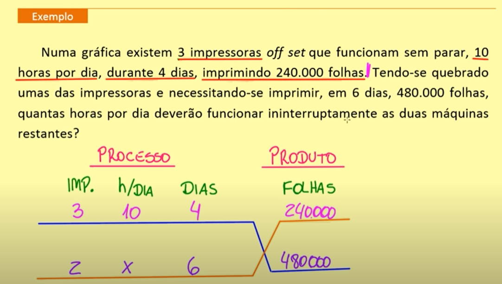

# ARITMÉTICA
Estudo das operações numéricas.

 

## Regra de Três
* É uma regra prática para resolver problemas que envolvam a relação entre grandezas diretamente ou inversamente proporcionais.

> #### REGRA DE TRÊS SIMPLES
* Usada para relações entre duas grandezas.

##### CÁLCULO
1. Identificar as grandezas dadas e ordena-las.
2. Identificar as novas grandezas com a grandeza que se quer obter (icógnita) e ordenar abaixo das anteriores.
3. Identificar se é a relação entre as grandezas é direta ou inversamente proporcional. (Pode-se usar a analogia das setas)
4. Para regra de três direta, multiplica-se de forma cruzada.
5. Para regra de três inversa, multiplica-se de forma direta.
6. Isola-se a icógnita dividindo os outros valores.

> #### REGRA DE TRÊS COMPOSTA
* Usada para relações que envolvem três ou mais grandezas.

##### CÁLCULO
1. Identificar as grandezas dadas e ordena-las entre processos (ações) e produto (resultado das ações) na reta em x.
2. Identificar as novas grandezas com a grandeza que se quer obter (icógnita) e ordenar abaixo das anteriores na reta em x.
3. Multiplicar as grandezas dadas seguindo os elementos da linha superior da reta em x.
4. Multiplicar as novas grandezas seguindo os elementos da linha inferior da reta em x.
5. Igualar as duas multiplicações.
6. Isolar a icógnita dividindo os outros valores.

    

