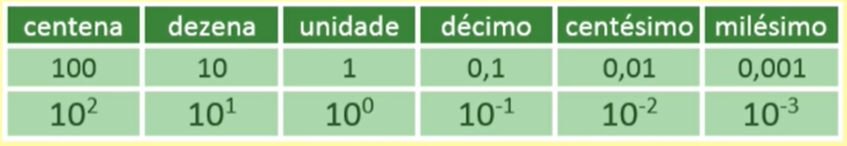

# ARITMÉTICA
Estudo das operações numéricas.

 

## Sistema de Numeração Decimal
* Também chamado de sistema hindu-arábico, sendo um sistema de base 10.
* O sistema decimal é um sistema posicional, ou seja, um mesmo algarismo muda de valor depedendo de sua posição.
* O algarismo zero, representa a ausência de um valor (nada).
* As quantidades são agrupadas de dez em dez.
* Representação do sistema decimal:
  - 0, 1, 2, 3, 4, 5, 6, 7, 8, 9

Ex: 1111 => 1 unidade, => 1 dezena, => 1 centena, => 1 milhar

> #### CLASSES E ORDENS
* Todo número inteiro é subdivivido em classes e cada classe possui três ordens.
* Classes:
  - unidades
  - milhares
  - milhões
  - etc
* Ordens:
  - unidade
  - dezena
  - centena

Ex: 84.506

    

 
 
 
 
 
 

> #### REPRESENTAÇÃO DECIMAL

    

 
 
 
 
 
 

## Operações com Números Decimais

> #### ADIÇÃO DE NÚMEROS DECIMAIS
* A adição de números decimais, igualando-se as parcelas em ordens iguais, tendo como parâmetro a posição da vírgula.
* Para diferentes quantidades de casas decimais, é necessário iguala-las, adicionando o valor zero.

Ex: 200,12 + 25,40 =  200,12 + 25,40 = 225,52

> #### SUBTRAÇÃO DE NÚMEROS DECIMAIS
* A subtração de números decimais, igualando-se as parcelas em ordens iguais, tendo como parâmetro a posição da vírgula.
* Para diferentes quantidades de casas decimais, é necessário iguala-las, adicionando o valor zero.

Ex: 10,72 - 5,4 =  10,12 + 5,40 = 5,32

> #### MULTIPLICAÇÃO DE NÚMEROS DECIMAIS
* Realiza-se a multiplicação normal e após o resultado, adiciona-se a vírgula na casa correspondente a soma da quantidade de casas após a vírgula dos fatores da multiplicação.

Ex: 34,6 . 12,111 = 419,0406  
12111 . 346 = 4190406     
34,6 (1 casa decimal) + 12,111 (3 casas decimais) = 4 casas decimais  
conta-se da direita 4 casas => 419,0406

> #### DIVISÃO DE NÚMEROS DECIMAIS
* Iguala-se o número de casas decimais do dividendo e do divisor.
* realiza-se a divisão normal eliminando a vírgula.

Ex: 14,8 : 2 = 7,4  
14,8 : 2,0 => 148 : 20 = 7,4