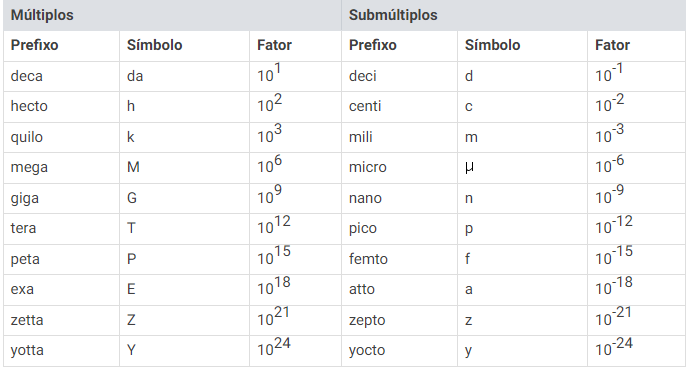

# ARITMÉTICA
Estudo das operações numéricas.

 

## Sistema Internacional de Unidades
* Determina as unidades de medida padrão e suas derivações.
* Os prefixos que aparecem antes de uma unidade de medida, representam potências de 10, sendo um fator multiplicador associado aos múltiplos e submúltiplos das unidades.

    

 
 
 
 
 
 
 
 
 
 
 
 

> #### UNIDADE DE MEDIDA DE COMPRIMENTO
* A unidade de medida padrão para comprimento é o metro.
* Seus principais múltiplos são três, assim como seus submúltiplos.

    

 
 
 
 
 
 
 
 

> #### UNIDADE DE MEDIDA DE TEMPO
* A unidade de medida padrão para o tempo é o segundo.

    

 
 
 
 
 
 
 

> #### UNIDADE DE MEDIDA DE MASSA
* A unidade de medida padrão para a massa é o quilograma.

    

 
 
 
 
 
 
 
 

> #### UNIDADE DE MEDIDA DE ÁREA
* A unidade de medida padrão para a área é o metro quadrado.

    

 
 
 
 
 
 
 

> #### UNIDADE DE MEDIDA DE VOLUME
* A unidade de medida padrão para o volume é o metro cúbico.

    

 
 
 
 
 
 
 
 
 
 
 

> #### UNIDADE DE MEDIDA DE CAPACIDADE
* A unidade de medida padrão para a capacidade é o litro.
* Relações entre unidades:
  - 1 litro = 1dm3 
  - 1000 litros = 1m3
  - 1ml = 1cm3

    

